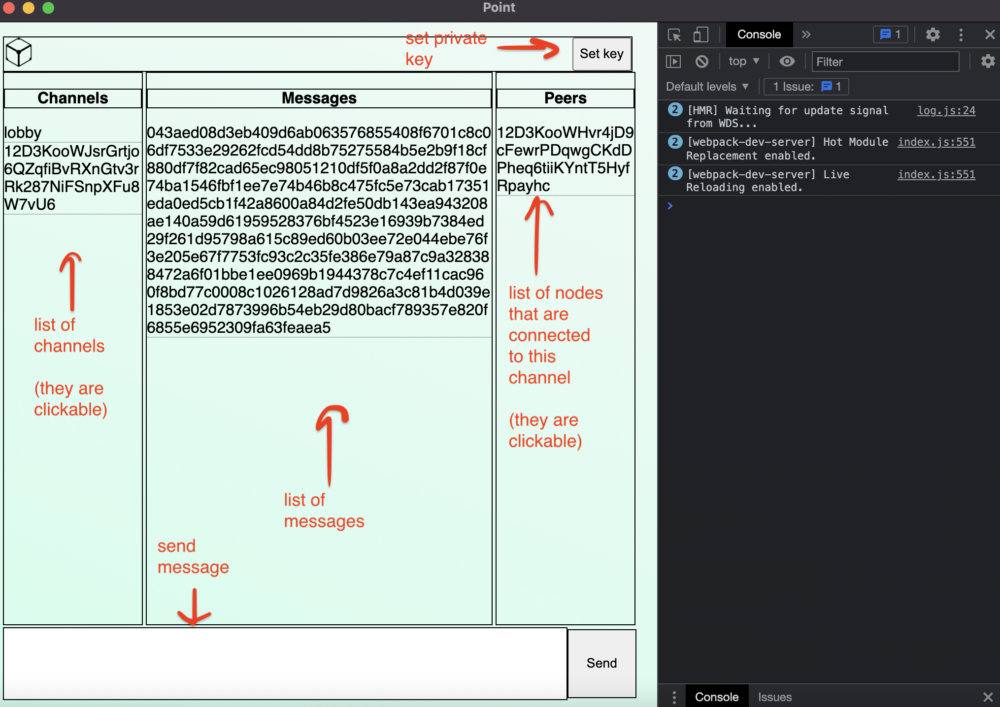
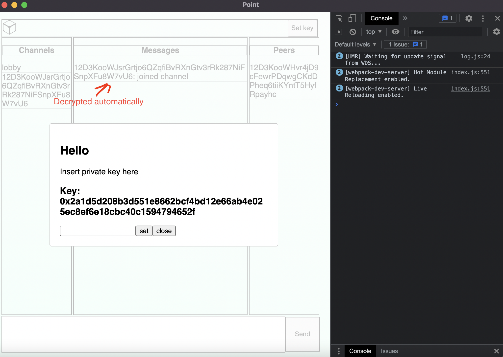
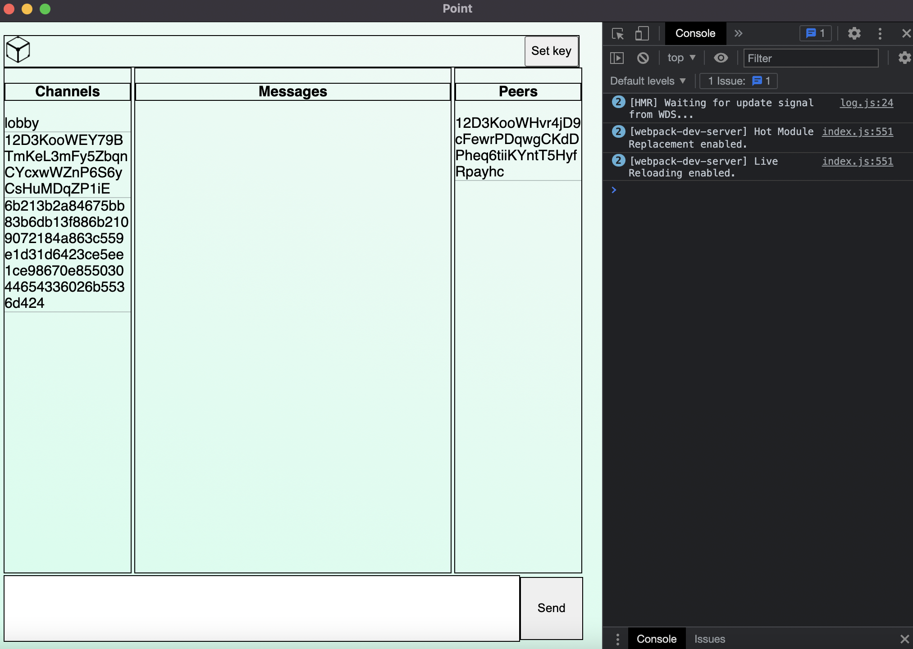

# Star

## TL;DR

Just another encrypted IRC

```
npm i
npm run start
```

## Description

Star is encrypted peer to peer chat. It uses IPFS and runs as desktop app in electron.

Previously Star was called [Sytime](https://github.com/ThirdRockEngineering/Sytime). I didn't like this name tbh. Sytime was IRC in browser and it wasn't encrypted at all. Browsers today are not best places to run IPFS, there are many technical difficulties. That's why i decided to use Electron atm.

## Why

At first it was just curiosity, I was thinking how to make serveless encrypted chat. Most popular chats today are using servers. But most of backend code is close source and I totally understand it: private keys need to be in secret places and stuff. I just don't like close source ¯\\\_(ツ)\_/¯

I want to make stars a bit more reachable and I believe open source will help us :stars:

In my dreams we all don't need encryption at all, because we all are friends :pensive:

## How does it work



As you can see:

- On the left we have all our channels
- On the right we have all peers from current channel
- In the middle all encrypted (atm) messages
- And two buttons: `Send` and `Set key`

There are two different types of channels

### General

Right now we are in `lobby` channel. You can see that we also subscribed on other channel - this is peer id from my ipfs-node. It's needed to establish p2p connection later on.

`lobby` is general channel, which means that anyone can obtain private key to it.

When we click `Set key` button a dialog pops up.


We set key and our messages history is now decrypted.


This is essentials to general channels.
Next one is

### Private

When I click on a peer in the list new channel is being created.


You can see on the left now we have 3 channels. The last channel is a huge random number - supposedly no one will be able to guess it. This is private channel for me and a peer I clicked on.


And private key for our channel already specified and is not chengeable. It is achieved with ECDH, but I'll talk about this later.

## How it was made

As already said, Star is built with IPFS and Electron.
Electron has two types of processes - processes for UI, which is chrome's browser window and main process which runs in nodejs.

IPFS is running completely in nodejs (main process).

### So let's talk main process

`ipfsd-ctl` is used to spawn `go-ipfs` as separate process (another one, third type specifically for ipfs node). And `ipfs-http-client` is used to connect to this node as to remote node. The reason for this is simple: I am sorry to telling this, but in my opinion `go-ipfs` at the moment I am writing this is much more stable than `js` verion.

`eciesjs`, which is handfull wrap around bitcoin's `secp256k1` for encryption. With this private key is created for every general chat (right now there is only one private key for every general chat). When private chat is created - each peer creates new private key for this specific chat and shares public key with other. `eciesjs` has built-in `multiply` function, which produces scalar multiplication for point on curve which allows to make ECDH.

### Renderer process

is UI. It's built with React and Redux. Redux appeared to be really neat within electron app.

The communication between main and renderer processes is a [big topic](https://www.electronjs.org/docs/latest/tutorial/ipc) in electron. Because it might be a big security issue I tried to stick to the rules and made IPC possible only via `preload` script.

## Resources:

You can check [roadmap](./ROADMAP.md) to see how it goes

List that might be helpful to get started

### For pubsub:

- https://github.com/libp2p/specs/blob/master/peer-ids/peer-ids.md
- https://github.com/ipfs/js-ipfs/blob/master/docs/core-api/PUBSUB.md

### For encryption:

To understand not very hard math and how things work in general

- https://cryptohack.org

Lib that I'm using

- https://ecies.org/js/

### Some for react maybe

Model aka Dialog

- https://reactcommunity.org/react-modal/accessibility/

## By the way

When I started this repo I also got a [Milady](https://opensea.io/collection/milady). So you can say that I was a bit inspired by the collection while was building

Hope it'll add some spirituality to the network

